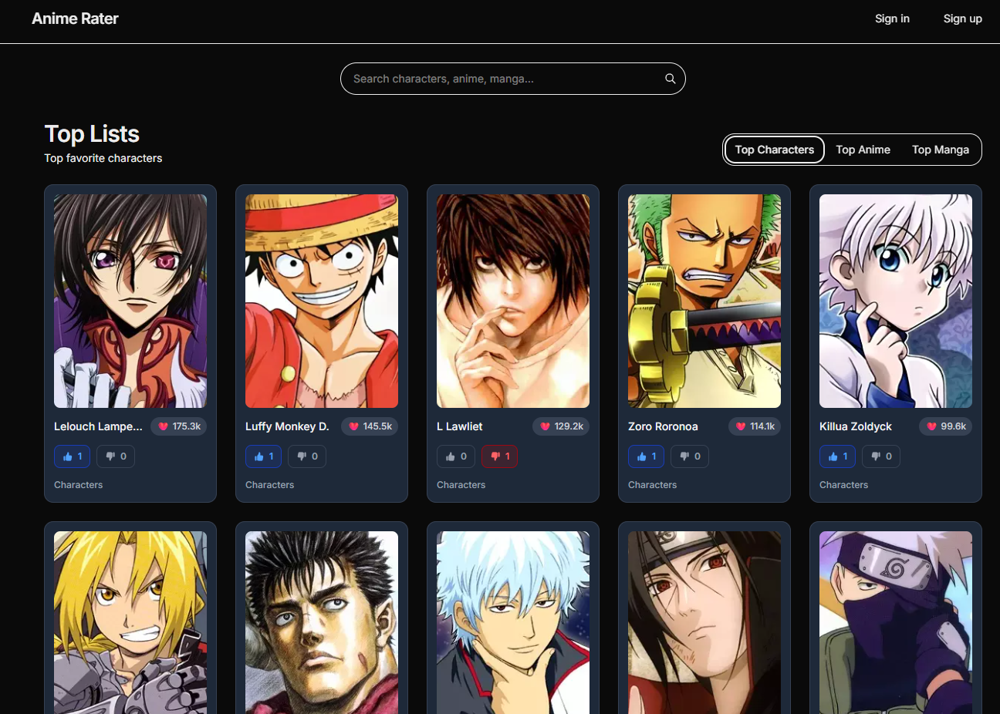
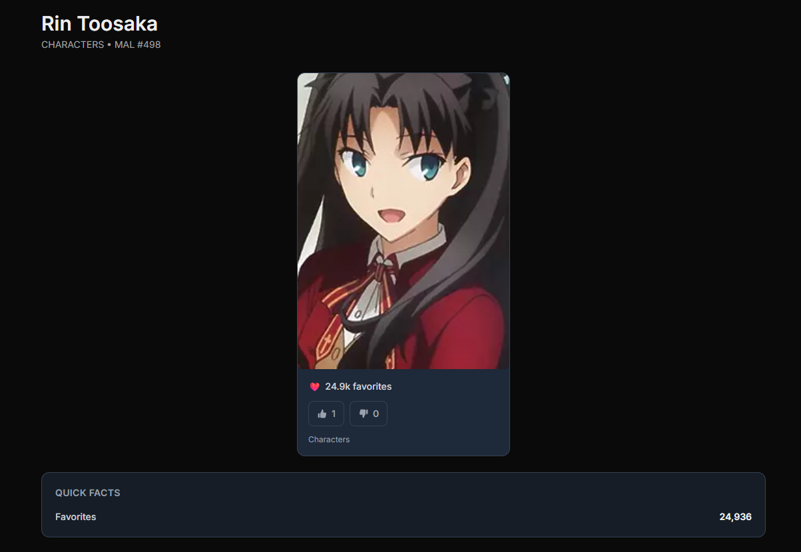
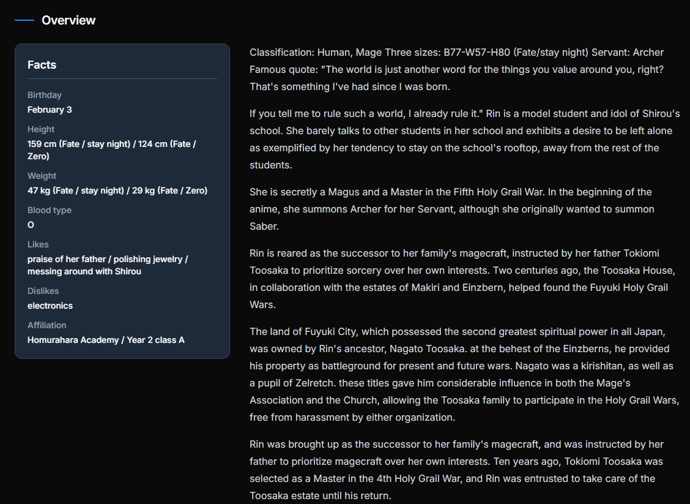
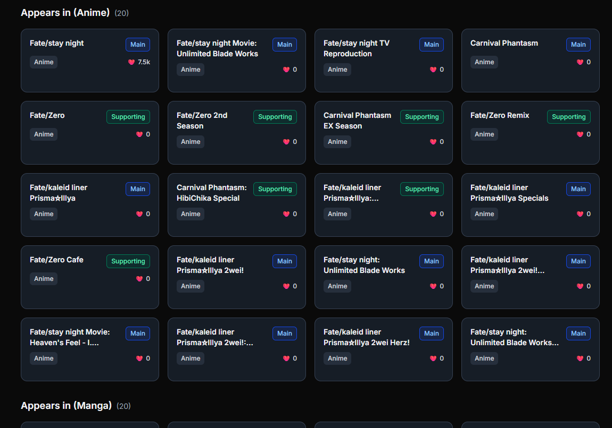
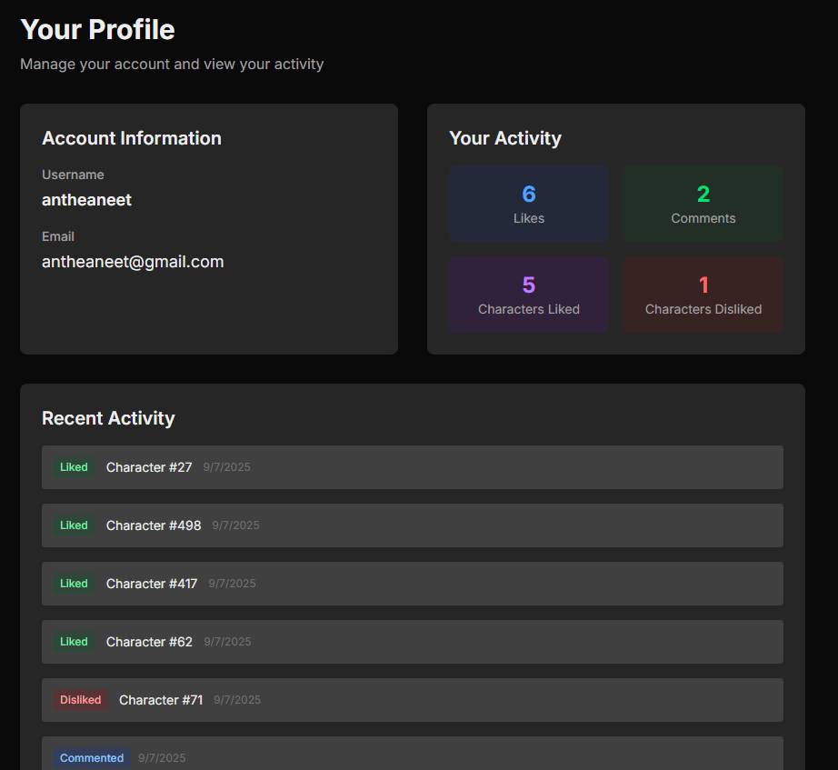
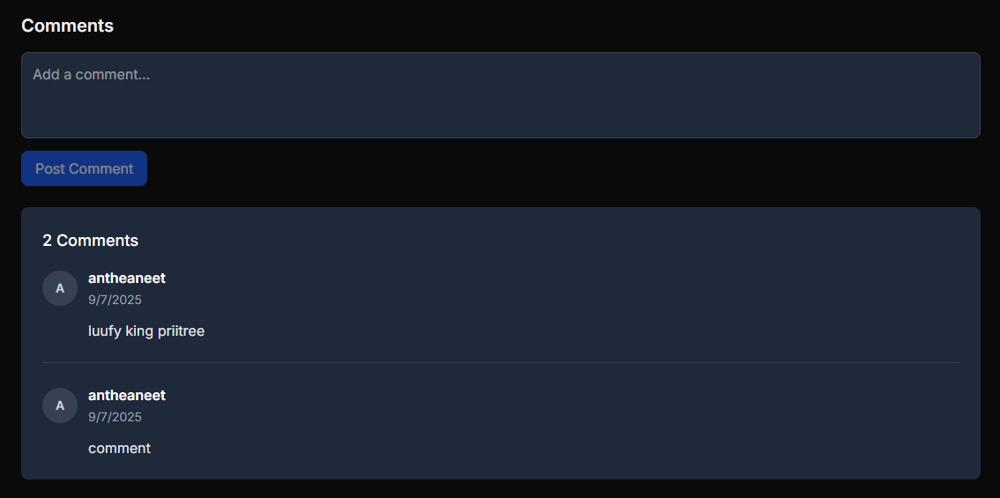
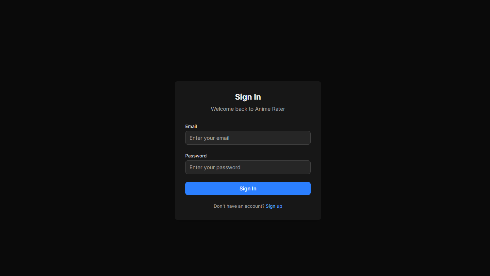
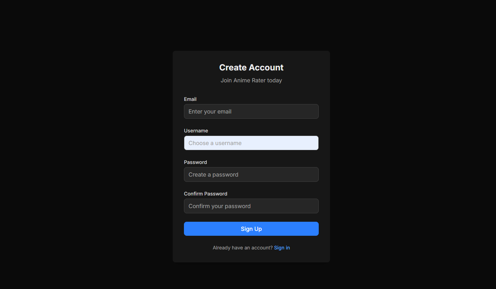
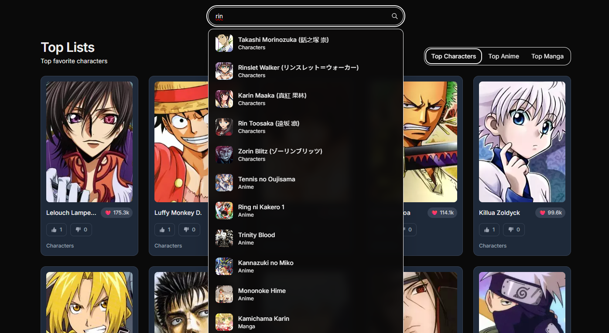

# Character Rater

A full-stack web application for browsing and ranking **anime**, **manga**, and **characters**.  
Users can sign in, like/dislike entries, leave comments, and view top favorites — all powered by the [Jikan API](https://jikan.moe/).

---

## Features
- 🔑 **Authentication** – Secure sign-in for personalized experiences.  
- ⭐ **Favorites Ranking** – Displays top anime, manga, and characters in descending order by popularity.  
- 💬 **User Interaction** – Like/dislike and comment functionality (full CRUD operations).  
- 📊 **ETL Pipeline** – Automated sync of anime/manga/character data from Jikan API into PostgreSQL.  
- 📱 **Responsive UI** – Built with Next.js + Tailwind CSS for a clean, modern design.  

---

## 🛠️ Tech Stack
**Frontend**: [Next.js](https://nextjs.org/) • TypeScript • [Tailwind CSS](https://tailwindcss.com/)  
**Backend**: [Fastify](https://fastify.dev/) (Node.js/TypeScript) • [Prisma](https://www.prisma.io/) ORM  
**Database**: PostgreSQL ([Supabase](https://supabase.com/))  
**Deployment**: Frontend → Vercel • Backend → Render • Database → Supabase  

---

## 📸 Screenshots

<em>Home Page - Browse top anime, manga, and characters</em>
  

<em>Character Details - View information and interact with characters</em>
  

<em>Another view of character details</em>
  

<em>Additional character information display</em>
  

<em>User Profile - Manage preferences and view activity</em>
  

<em>Comments Section - Read and post comments</em>
  

<em>sign in page</em>
  

<em>sign up page</em>
  

<em>Search for anime details</em>
  

